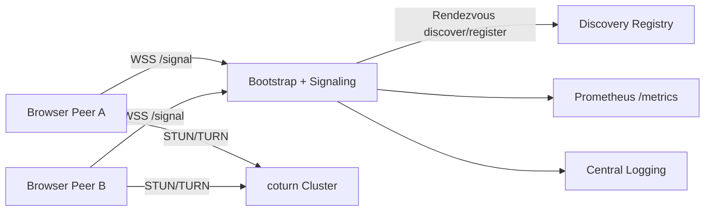

# Browser Sync Production Design

## 1) 서비스 최소 인프라 (WebPEER 운영 기준)
- Edge/API gateway: TLS 종료, WAF, DDoS/봇 필터
- Bootstrap + Signaling service: WebSocket `/signal`, HTTP `/bootstrap`, `/rendezvous/*`
- TURN cluster (coturn): NAT 우회 릴레이
- Metrics + logs: Prometheus + Grafana + 중앙 로그(ELK/Loki)
- Optional Redis: 멀티 인스턴스 room membership 공유가 필요할 때 사용

## 2) 룸/네임스페이스 설계
- `namespace`: 서비스 테넌트 또는 앱 영역 (예: `globalroom`, `team-alpha`)
- `room`: namespace 내부의 채널
- 공개 룸(public/global): 누구나 조인 가능, 읽기 중심, 업로드 정책 제한
- 초대코드 룸(invite): 서버 발급 invite code 또는 signed room token 필요
- 권장 키: `namespace::room`
- 권한 모델:
  - 공개 룸: anonymous read + throttled write
  - 초대 룸: authenticated read/write
  - 관리자 룸: moderation/delete 강제

## 3) 시그널링 서버 인증/레이트리밋
- 인증:
  - WebSocket handshake 시 `Authorization: Bearer <token>` 또는 query token
  - 서버는 `SIGNAL_TOKEN_SHA256`과 상수시간 비교
- 레이트리밋:
  - 연결 수 제한: IP당 동시 연결 수 (`RATE_LIMIT_CONNECTIONS_PER_IP`)
  - 메시지 제한: IP당 분당 메시지 수 (`RATE_LIMIT_MESSAGES_PER_MINUTE`)
- 남용 방지:
  - oversized frame 차단
  - 동일 payload 반복 전송 패턴 탐지
  - bad actor IP/ASN 블록룰

## 4) Bootstrap + Signaling 컨테이너
- 코드: `/server/bootstrap-signaling/src/server.js`
- 엔드포인트:
  - `GET /health`
  - `GET /bootstrap?namespace=&room=`
  - `GET /metrics`
  - `POST /rendezvous/register`
  - `GET /rendezvous/discover`
  - `WSS /signal`
- 배포: `infra/k8s/bootstrap-signaling.yaml`

## 5) TURN 서버 설계
- STUN: `stun:stun.l.google.com:19302`
- TURN: coturn (UDP 3478 + TCP/TLS fallback 5349)
- 인증: long-term credential + shared secret (`use-auth-secret`)
- 배포 예시:
  - Docker Compose: `infra/turn/docker-compose.yml`
  - K8s: `infra/k8s/coturn.yaml`

## 6) Monitoring / Logging 설계
수집 대상:
- ICE 연결 상태 성공률: `connected/completed` 비율
- 실패 사유: `timeout`, `candidate-pair-failed`, `signaling-failed`
- relay 사용 여부: TURN 사용량
- 지역/통신사별 통계: `region`, `carrier`

서버 구현:
- telemetry message (`type=telemetry`) 수신 후 `/metrics` 노출
- 주요 메트릭:
  - `bs_ws_connections_total`
  - `bs_ws_messages_total`
  - `bs_ws_auth_failures_total`
  - `bs_ws_rate_limited_total`
  - `bs_relay_usage_total`
  - `bs_ice_state_total{ice_state=*}`
  - `bs_failure_reason_total{reason=*}`
  - `bs_region_carrier_total{region=*,carrier=*}`

## 7) Discovery: libp2p rendezvous 프로토콜 매핑
- `RendezvousRegistry`는 libp2p rendezvous 개념의 최소 구현
- register: peer가 namespace/room에 TTL 기반 등록
- discover: room별 peer 목록 조회
- prune: TTL 만료 peer 자동 정리
- 코드: `/server/bootstrap-signaling/src/rendezvous.js`

## 8) 운영 체크리스트
- Edge proxy에서 WebSocket sticky session 또는 room-aware hashing
- Signaling 수평확장 시 shared state(예: Redis pub/sub)
- TURN은 멀티 리전 배치 + Anycast/DNS geo routing
- 개인정보 최소화: region/carrier는 익명 집계만 저장
- audit log retention 정책 수립
